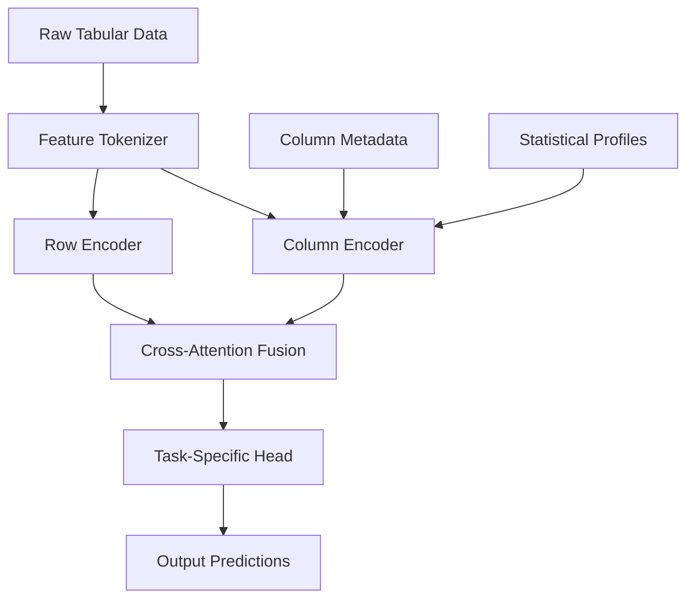

# TabGPT Foundation Model Design Document

## Overview

TabGPT is a transformer-based foundation model designed to learn universal representations from tabular data through self-supervised pre-training. The architecture combines proven tabular transformer designs (FT-Transformer) with novel cross-schema generalization capabilities, enabling transfer learning across datasets with different column structures. The model uses a hybrid approach with separate row and column encoders, unified through multi-head attention mechanisms.

## Architecture

### High-Level Architecture



### Core Components

1. **Feature Tokenizer**: Converts heterogeneous tabular data into uniform token representations
2. **Column Encoder**: Learns semantic embeddings for column metadata and statistics
3. **Row Encoder**: FT-Transformer-based encoder for processing row-level patterns
4. **Cross-Attention Fusion**: Multi-head attention mechanism combining row and column information
5. **Task-Specific Heads**: Modular output layers for different downstream tasks

## Components and Interfaces

### Feature Tokenizer

**Purpose**: Standardize diverse tabular data into token embeddings suitable for transformer processing.

**Interface**:
```python
class TabularTokenizer:
    def __init__(self, vocab_size: int, embedding_dim: int)
    def tokenize(self, dataframe: pd.DataFrame) -> TokenizedTable
    def encode_categorical(self, values: List[str]) -> torch.Tensor
    def encode_numerical(self, values: List[float]) -> torch.Tensor
    def encode_datetime(self, values: List[datetime]) -> torch.Tensor
```

**Implementation Details**:
- Categorical features: Learned embeddings with vocabulary management
- Numerical features: Binning + embedding or direct normalization + linear projection
- Datetime features: Cyclical encoding (sin/cos) + learned temporal embeddings
- Missing values: Special [MASK] token with learned embedding

### Column Encoder

**Purpose**: Generate semantic embeddings for columns that enable cross-dataset transfer.

**Interface**:
```python
class ColumnEncoder:
    def __init__(self, text_encoder: str = "sentence-transformers/all-MiniLM-L6-v2")
    def encode_column_metadata(self, column_info: ColumnMetadata) -> torch.Tensor
    def compute_statistical_profile(self, column_data: pd.Series) -> torch.Tensor
```

**Components**:
- **Column Name Embeddings**: Pre-trained sentence transformer for semantic understanding
- **Statistical Profile Embeddings**: Mean, std, skewness, kurtosis, entropy, cardinality
- **Type Embeddings**: Learned embeddings for categorical, numerical, datetime, boolean
- **Distribution Embeddings**: Histogram-based or kernel density estimation features

### Row Encoder (FT-Transformer Backbone)

**Purpose**: Learn row-level representations using proven transformer architecture.

**Interface**:
```python
class RowEncoder(nn.Module):
    def __init__(self, d_model: int, n_heads: int, n_layers: int)
    def forward(self, tokenized_rows: torch.Tensor, attention_mask: torch.Tensor) -> torch.Tensor
```

**Architecture Details**:
- Based on FT-Transformer with feature tokenization
- Multi-head self-attention across features within each row
- Layer normalization and residual connections
- Positional encodings for feature order (optional, since tabular data is typically unordered)

### Cross-Attention Fusion

**Purpose**: Combine row-level patterns with column-level semantics for enhanced representations.

**Interface**:
```python
class CrossAttentionFusion(nn.Module):
    def __init__(self, d_model: int, n_heads: int)
    def forward(self, row_embeddings: torch.Tensor, column_embeddings: torch.Tensor) -> torch.Tensor
```

**Mechanism**:
- Row embeddings as queries, column embeddings as keys/values
- Bidirectional attention allowing columns to attend to row patterns
- Residual connections preserving original row representations

## Data Models

### Core Data Structures

```python
@dataclass
class ColumnMetadata:
    name: str
    dtype: str  # 'categorical', 'numerical', 'datetime', 'boolean'
    cardinality: int
    missing_rate: float
    statistical_profile: Dict[str, float]

@dataclass
class TokenizedTable:
    tokens: torch.Tensor  # [batch_size, n_features, embedding_dim]
    attention_mask: torch.Tensor  # [batch_size, n_features]
    column_metadata: List[ColumnMetadata]
    
@dataclass
class PreTrainingBatch:
    input_tokens: torch.Tensor
    masked_positions: torch.Tensor
    target_values: torch.Tensor
    column_embeddings: torch.Tensor
```

### Pre-Training Objectives

#### Masked Cell Modeling (MCM)
- Randomly mask 15% of cells in each row
- Predict original values using cross-entropy (categorical) or MSE (numerical)
- Similar to BERT's masked language modeling

#### Masked Column Modeling
- Mask entire columns (20% probability)
- Predict column values from remaining features
- Encourages learning feature relationships

#### Contrastive Row Learning
- Apply data augmentation: noise injection, feature dropout, value perturbation
- Maximize similarity between augmented versions of same row
- Use InfoNCE loss with temperature scaling

#### Next Row Prediction (Time-Series)
- For temporally ordered data, predict next row given previous rows
- Autoregressive objective similar to GPT

## Error Handling

### Data Quality Issues
- **Missing Values**: Handle through special tokens and attention masking
- **Outliers**: Robust normalization techniques (quantile-based)
- **Schema Mismatches**: Graceful degradation when columns don't match training distribution

### Model Robustness
- **Gradient Clipping**: Prevent exploding gradients during pre-training
- **Dropout**: Feature dropout and attention dropout for regularization
- **Early Stopping**: Monitor validation loss to prevent overfitting

### Runtime Errors
```python
class TabGPTError(Exception):
    pass

class SchemaError(TabGPTError):
    """Raised when input schema is incompatible"""
    pass

class TokenizationError(TabGPTError):
    """Raised when feature tokenization fails"""
    pass
```

## Testing Strategy

### Unit Tests
- **Feature Tokenizer**: Test encoding of different data types
- **Column Encoder**: Verify semantic similarity of related columns
- **Row Encoder**: Test attention patterns and gradient flow
- **Pre-training Objectives**: Validate loss computation and masking logic

### Integration Tests
- **End-to-End Pre-training**: Small synthetic datasets with known patterns
- **Fine-tuning Pipeline**: Test adaptation to downstream tasks
- **Cross-Dataset Transfer**: Evaluate on datasets with different schemas

### Performance Tests
- **Memory Usage**: Profile memory consumption with large datasets
- **Training Speed**: Benchmark training throughput
- **Inference Latency**: Measure prediction speed for real-time applications

### Evaluation Benchmarks
- **OpenML CC18**: Standard tabular benchmark suite
- **UCI Repository**: Classic datasets for comparison
- **Kaggle Competitions**: Real-world performance validation
- **Domain-Specific**: Healthcare, finance, IoT datasets

## Implementation Phases

### Phase 1: Core Architecture
- Implement Feature Tokenizer with basic data type support
- Build FT-Transformer-based Row Encoder
- Create simple Column Encoder with statistical profiles
- Implement Masked Cell Modeling objective

### Phase 2: Advanced Pre-training
- Add Contrastive Row Learning objective
- Implement Masked Column Modeling
- Add support for temporal data and Next Row Prediction
- Optimize training pipeline for large-scale datasets

### Phase 3: Transfer Learning
- Implement task-specific heads (classification, regression, etc.)
- Add HuggingFace-compatible interfaces
- Create fine-tuning utilities and adapters
- Build evaluation framework

### Phase 4: Production Features
- Add model serving capabilities
- Implement efficient inference optimizations
- Create comprehensive documentation and tutorials
- Build dataset preprocessing utilities

## Technical Considerations

### Scalability
- **Distributed Training**: Support for multi-GPU and multi-node training
- **Memory Optimization**: Gradient checkpointing and mixed precision training
- **Data Loading**: Efficient data pipelines for large tabular datasets

### Compatibility
- **HuggingFace Integration**: Compatible with transformers library ecosystem
- **Framework Support**: Primary PyTorch implementation with potential TensorFlow/JAX ports
- **Hardware**: Optimized for both GPU and CPU inference

### Extensibility
- **Custom Objectives**: Plugin architecture for new pre-training tasks
- **Model Variants**: Support for different sizes (base, large, xl)
- **Domain Adaptation**: Specialized versions for specific domains (healthcare, finance)